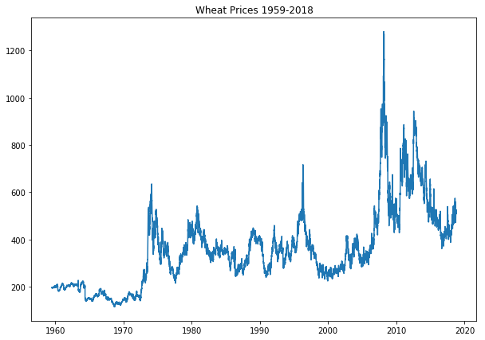
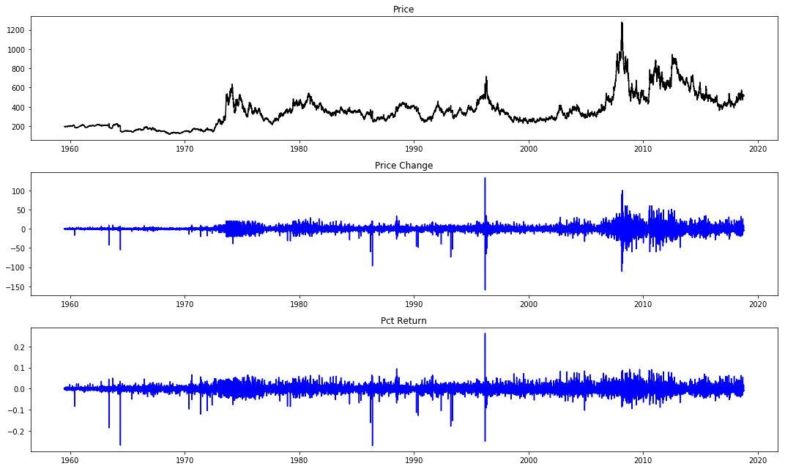
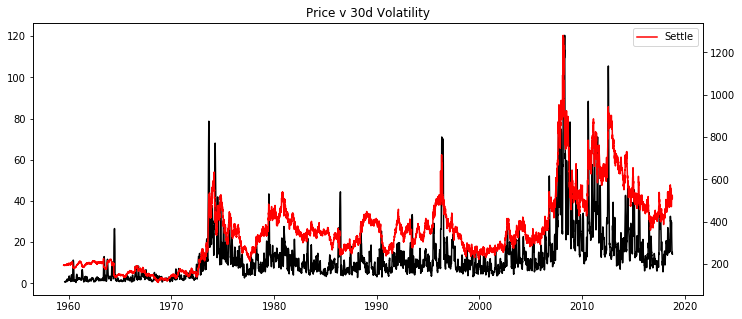
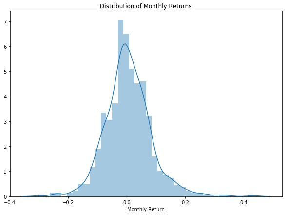
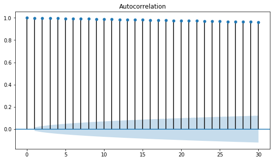
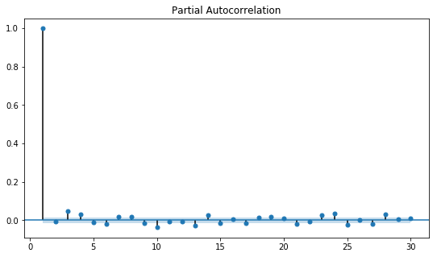
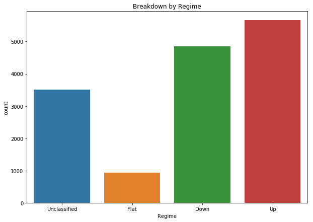
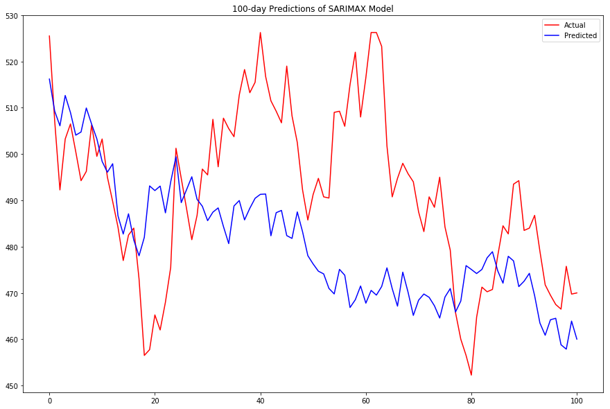
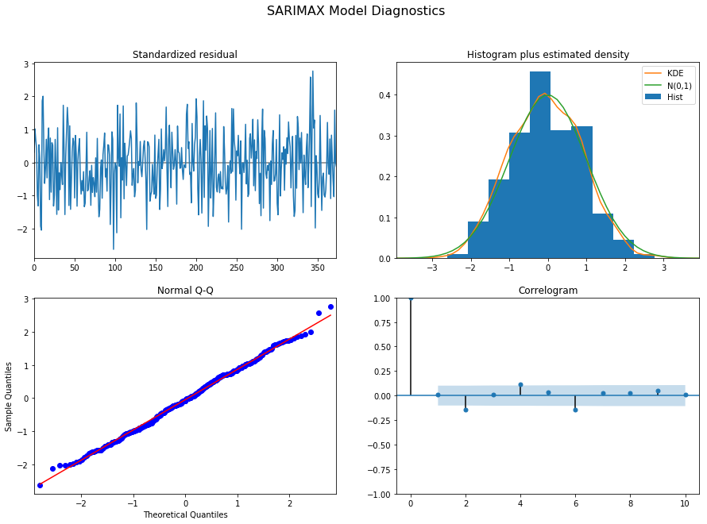

# Wheat Market Analysis
## Technical Report

### Matthew Garton - October 2018

# Problem Statement

The ultimate goal of my project is to develop a trading strategy for commodity futures, which will include both prediction modeling to identify price patterns and trading opportunities as well as a rules-based algorithm to make trading decisions and manage risk. For the purposes of this project, I will attempt to predict future price movements in wheat futures using time series and LSTM modeling techniques with technical indicators as exogenous variables.

# Data Gathering and Preparation

The dataset I am using is the Wheat Futures Continuous Contract (W1) Front Month time series from the 'Wiki Continuous Futures' product on [Quandl](https://www.quandl.com/). This is a free dataset curated by Quandl using daily futures prices from the Chicago Mercantile Exchange. For each day in the series (which includes all trading days from 07/01/1959 to present) the dataset includes Open, High, Low, Last, Change, Settle, Volume,and Previous Day Open Interest.

https://www.quandl.com/data/CHRIS/CME_W1-Wheat-Futures-Continuous-Contract-1-W1-Front-Month

After gathering the data and cleaning it by filling in missing values using appropriate assumptions (see data prep notebook), I generated a number of features that I thought would be useful for further analysis. These include rolling averages and standard deviations on a number of different ranges (up to 360 days), an indicator called the Parkinson Ratio (formula below), and categorical variables which indicate if the particular day is a turning point, and which 'Regime' (Up, Down, Flat, or Unclassified) the date falls under).

Formula for Parkinson Ratio:

Source: Taleb, N.N. (1997). *Dynamic Hedging: Managing Vanilla and Exotic Options*, New York: John Wiley & Sons, Inc. 

# EDA

## Price History

First, I looked at the full price history, as well as the differenced data, for the full time series, in order to get a 'big picture' sense of the history of the wheat market. Something that becomes apparent from a quick glance is that the market periodically (looks like once a decade) experiences a very sharp upwards trend, followed by a similarly steep downwards trend. Additionally, looking at the price data confirms what my outside reading and intuition would suggest, which is that large, persistent trends do exist and seem to dominate the price history. This presents an opportunity for a very profitable trading strategy if the trends can be identified early enough.

### Relationship between Price Level, Return, and Volatility

It looks like there is a positive relationship between price and volatility. Intuitively, this makes sense, as extreme moves tend to be to the upside, and given that wheat is a food product, I'm not surprised that the 'fear' in the market is to the upside. I'd like to examine this further. Below is a pairgrid exploring the relationships between price, vol, moving average, and volume. As expected, price is positively correlated to the moving average and to volatility, as well as volume. I believe this is driven by the extreme upward price spikes.

## Distribution of Returns: Summary of Data

As expected, the distributions of returns are not normal - on daily, weekly, monthly, or yearly time scales. Most notably, the return distributions are highly kurtotic. There are far more observations than expected within one standard deviation of the mean. What surprised me initially is that the number of observations outside of 2 and 3 standard deviations from the mean was approximately equal to what you would see in a normal distribution. Looking closer at the data, I can see that this is accounted for by the fact that there are some observations several standard deviations from the mean (several observations greater than 5 or 6 standard deviations - which is extremely unlikely in a normal distribution). So the kurtosis does not come from having more observations outside of the 3 standard deviation cutoff, as I presumed - it comes from the fact that the observations we do see in the tails are so much more spread out than expected.

The daily data are not meaningfully skewed, but as longer and longer time ranges, a positive right tail emerges. This is consistent with that the price plots show - that the extreme moves in this market are to the upside.

### (Optional Reading) Note on extreme outliers in daily data:

One aspect of the daily returns distribution concerned me, the prevalence of extreme outliers (in the 16-18 s.d. range). I noticed that there was a pattern to the dates on which these moved occurred - several of them were on March 20th, or May 20th, or 21st, etc. My hunch was that these represented expiration dates. It turns out that is the case, these extreme moves happened on around or after the market close on days when the first contract was expiring (seeing moves of this magnitude is one downside of using data for the front month contract up until the last day - as discussed above in 'Data Wrangling'). My research uncovered another interesting fact about the dates in question - the price movement on these days actually prompted CFTC investigations into potential market manipulation. One such example is documented in the settlement linked below, from March 20, 1996 (a day which say a 26% (or 18z) move in front month wheat.

https://www.cftc.gov/sites/default/files/ogc/oporders97/ogcwheat6.htm

### (End of Optional Reading)

## Visual Analysis of Autocorrelation and Partial Autocorrelation

As expected, prices exhibit significant autocorrelation, well outside the confidence bands. When looking at partial autocorrelation, a stark drop off is seen after the first lag, which has an autocorrelation of almost 1.0. I interpret this as suggesting that prices represent a Markov process, where the next period's price depends heavily on today's price, but is largely unrelated to prior price history, conditional on the most recent observed price. This presents a potential limitation in my research, as the data does look very much like a 'random walk.' If so, it should not be possible to use pattern recognition on past prices to predict future prices.

## Regimes and Trends in History

Regimes tend to last, on average, 92 days, with significant variation. The shortest regime recorded was only 3 days long, and the longest lasted well over a year. The median regime had slightly negative total return, and there is a long right tail on regime returns, consistent with the positive skewness observed in the distribution of returns above. 

Note that the majority of observations in the data come from trends (upward or downward) in which the market moved at least 10% between turning points. This supports the hypotheses that the market trends more often than ranges (the market is only considered 'Flat' about 7% of the time), and that trends tend to persist,once formed. This, coupled with the data on duration and returns from trends, suggests evidence in favor of a trend following strategy.

# Modeling

## ARIMA Models 

### Optimizing hyperparameters (*p*, *d*, *q*)

**Find the correct value of *d*: Dickey-Fuller Tests**

The first step in my model design is to find the appropriate level of differencing (the hyperparameter *d* in ARIMA-based models) in order to ensure stationarity. In order to find the optimal value of *d*, I built a function to essentially 'gridsearch' p-values of Dickey-Fuller Tests over possible values of *d* (I tested all integers 1-100, but for computational efficiency, I am only demonstrating the search between 1 and 10 here). What I found was that a value of 1 was the best, so I use 1 for differencing in my models below.

### Scoring Metric: Akaike's Information Criterion (AIC)

I evaluated all models built in two ways, one quantitative and one qualitative. Something I learned from trial and error is that *R2* does not seem to be a reliable metric for time series models. The *R2* values I found in my models were close to 1 on training data and varied wildly on testing data. On testing data, they were consistently below zero. This is not entirely surprising given the well-known tendency of AR models to overfit. However, looking at plots of predictions versus actual testing data, the models were not entirely useless, they just couldn't predict with precision. Also, there was a limit to how far forward the models could predict with any reasonably margin for error.

In order to evaluate the usefulness of a model in a general sense, I did more qualitative analysis, visualizing the predictions versus the testing data. This would quickly tell me if the model should be thrown out, or if it had some limited use. Furthermore, it would tell me how far forward, if at all, the model could reasonably predict.

I used a quantitative metric, Akaike's Information Criterion (AIC) in order to select between models. This is relative metric and doesn't provide useful information as to whether one model is good or bad, but it can tell me if one model is better than another - lower values of AIC indicate better models.

**Formula for AIC:**

As a starting point to optimizing ARIMA based models, I built a function to 'gridsearch' for optimal values of *p* and *q* in my time series models, optimizing for the lowest value of AIC when fitting a (*p*, *d*, *q*) ARIMA model.

It appears that larger values of *p* and *q* are slightly better, based on gridsearching alone. I actually had more luck with trial and error on fitting different ARIMA and SARIMAX models to find better values of *p* and *q*. What I noticed was that in order to pick up any kind of pattern and to avoid being overly influenced by the most recent observations, it was important to use large values of *p* and *q* (*p* in particular). This makes sense - if there is a pattern to detect, my model needs enough 'memory' to detect that pattern. Otherwise I am essentially extrapolating a Markov process and getting essentially random results.

## SARIMAX Models

The best time series model I was able to make was a SARIMAX model. While not perfect, it has some predictive value over a short enough forecast horizon while being simple enough to interpret. I used the following values of ($p$, $d$, $q$) and (*P*, *D*, *Q*, *S*):

(*p*, *d*, *q*) = (20, 1, 15)

(*P*, *D*, *Q*, *S*) = (1, 1, 1, 4)

along with the following exogenous variables:

    -Volume 
    -30 Day Historical Volatility 
    -30 Day Parkinson Ratio 
    -Dummy Variables for Regime (Flat, Unclassified, Up) with Down as the excluded category.
    

## Model Results
    

| Dep. Variable:	y                       | No. Observations: 403    |
|---------------------------------------|--------------------------|
| Model:	SARIMAX(20, 1, 15)x(1, 1, 1, 4) | Log Likelihood:	-1416.231 |
| Date:	Fri, 19 Oct 2018                 | AIC:	2920.462             |
| Time:	11:39:59                         | BIC: 3096.415            |
| Sample:	0                              | HQIC:	2990.121            |
| - 403		                                 |                          |
| Covariance Type:	opg                   |                          |
    
### Note: Choosing the Sample

In my analysis, I tried a number of different windows of time for taining and testing, with varied results. I would encourage the reader to experiment with different time periods and train test splits, as results do in fact differ depending on time period and location of train test split. This is certainly a weakness in the modeling, but examining the different successes and failures can, I believe, provide some useful insights into how to evaluate and ultimately improve the modeling framework.

# Summary and Next Steps

In summary, AR, MA, ARMA, ARIMA, and SARIMAX models appear to be of limited use in predicting future prices. Within some level of confidence, they appear to be 'OK' at forecasting up to about 10 days out, but fall apart outside of that range. To achieve better predictions, I plan to pursue the following different approaches:

1. A more advanced model, such as a LSTM neural network.
2. Adding more exogenous variables, including technical indicators and outside data (wheather, supply and demand, etc.)
3. Attempting to inforcorate a way for the model to learn from it's predictions. I noticed that, since trends persist once formed, the model's bias often compounds if it goes in the wrong direction. When the model makes a prediction for one period, it should evaluate and then 'overcorrect' if it misses the mark. 
4. Identifying which periods the model works well on versus which periods it fails on, and trying to identify the factors that drive the success or failure, would help me to either refine the model, or know how confident to be in its output.
